# .NET examples

This is a simple demonstration of how to use [MQTTnet](https://github.com/dotnet/MQTTnet) library to create a .Net application to exchange MQTT messages between an IoT device and a Supervisor application.

The IoT devices I used to implement the examples were Raspberry PI 4B and Raspberry PI Zero 2W.

Below you will find details of the devices and how to wire the hardware.

## Docker compose

Prerequisites:
* Docker Desktop installed on the development machine where you would like to run the examples


To start the Docker Compose solution, cd to the Deployment folder and run the following command:
>docker compose up --build -d

This is an out-of-the-box solution that includes all the necessary dependencies to build and run a complete solution, including the MQTT broker.

It will automatically detect that you are running in a container on an x86 machine, and it will use fake sensors instead of real Sense Hat or BMP280 sensors. However, there may be a slight problem if you are running Docker on an ARM processor. In this case you should edit the relevant Program.cs classes and replace this RuntimeIdentifier with the one that ensures that the mocked version of the sensors is used.


```
if (Runtime.RuntimeIdentifier.Contains("linux-arm") || Runtime.RuntimeIdentifier.Contains("raspbian"))
```

## Setting up Raspberry PIs

I will provide details for each model in separate sections, but there are some common steps that need to be taken to install the operating system on the Raspberry PI devices.

1. Get Raspberry Pi Imager from Raspberry Pi site
   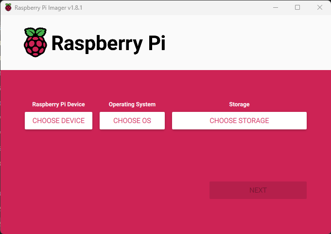
2. Choose the right device type
   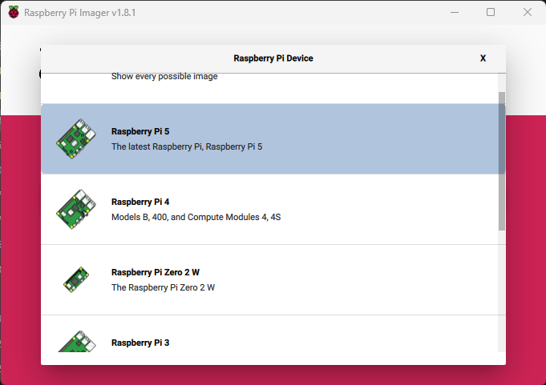
3. Choose the OS
   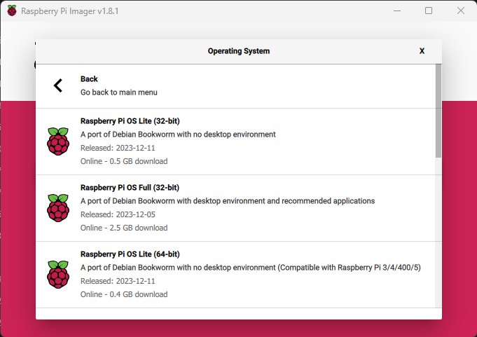
4. Choose the storage
   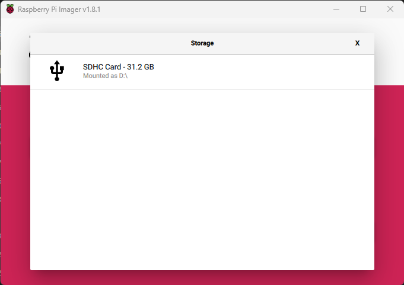
5. Edit Settings to customize the image
   
6. Setup the Account settings and WIFI (wifi is optional for boards containing ethernet interface)
   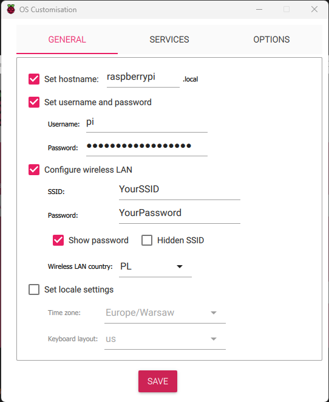
7. Enable SSH
   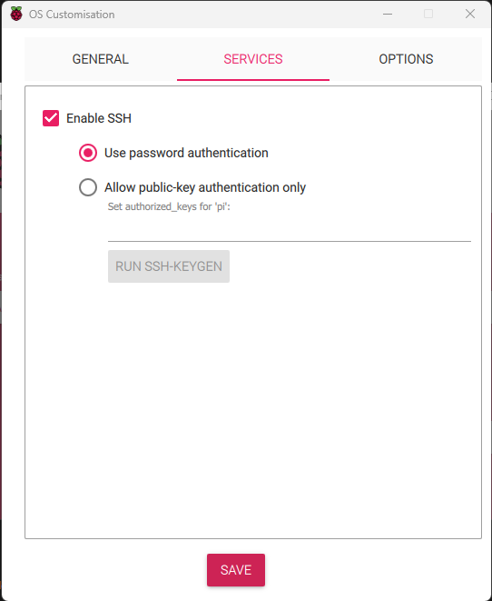

I usually choose the Lite version of the OS that comes with the Raspberry Pi, as I'm mostly using it as a remote Linux machine. But you can choose otherwise.

Instead of the user/password SSH configuration shown in the screenshot, you can provide the public key from the private/public key pair if you generate it before hand using openSSL or PuTTY Key Generator.

The wireless LAN country should be set according to your country of residence.

8. Connect to the device

Once you have successfully configured and installed the image on the Raspberry device, you should be able to ssh into it.

From the Windows machine, you can use the ssh command:
>ssh username@xxx.xxx.xxx.xxx

The `username` should contain the user set in step 6 and the `xxx.xxx.xxx.xxx` should be replaced with the IP address of the device. You should be able to find this address in your router's wireless clients list.

9. Install the `dotnet` SDKs and runtimes. 

Run these commands from the Raspberry Pi shell

>wget https://dot.net/v1/dotnet-install.sh -O dotnet-install.sh
 
>chmod +x ./dotnet-install.sh

>./dotnet-install.sh --version latest --runtime dotnet --arch arm --channel 6.0

>echo 'export DOTNET_ROOT=$HOME/.dotnet' >> ~/.bashrc
>echo 'export PATH=$PATH:$DOTNET_ROOT:$DOTNET_ROOT/tools' >> ~/.bashrc

If you are interested in the full guide, you can find it here: [dotnet-install script](https://learn.microsoft.com/en-us/dotnet/core/tools/dotnet-install-script) 

11. Install / update git

>sudo apt install git

10. Clone the git repository with the source code

> git clone https://github.com/zielinski-piotr/MqttClient4IoT.git

11. Ensure I2C interface is enabled on your Raspberry Pi device

> sudo raspi-config

Go to `Interface Options`
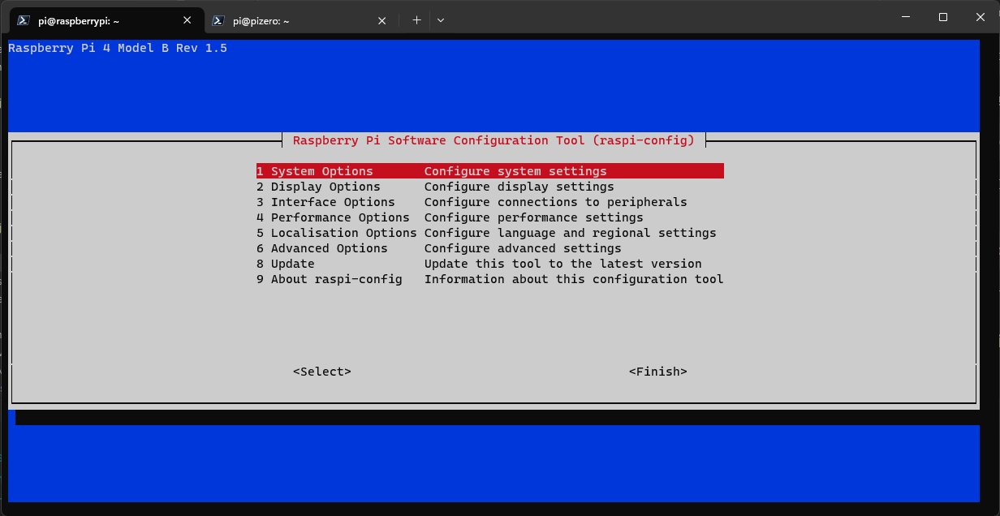

Select `I2C`
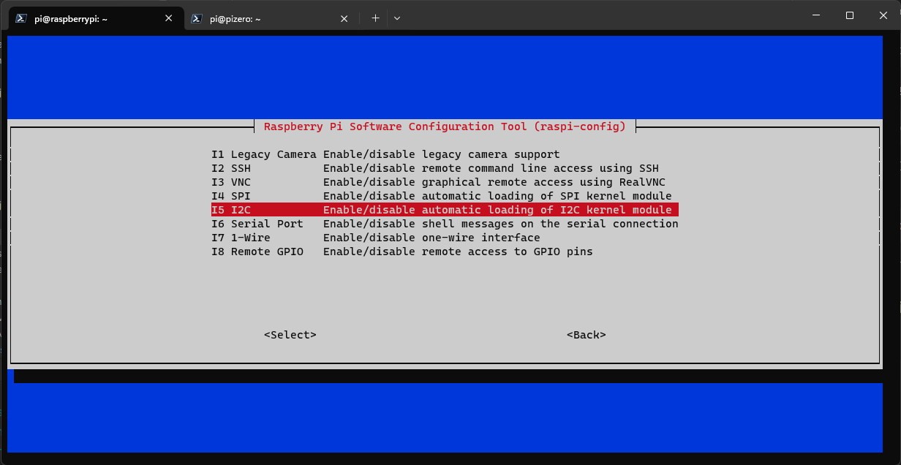

Confirm enabling
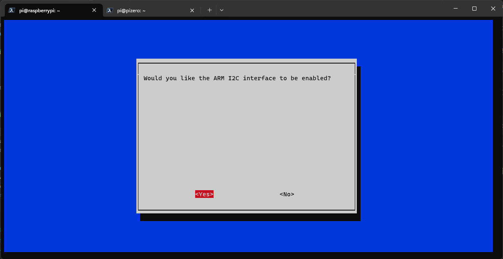


12. Build and run the application (see sections below)

## Clients.Rpi

Clients.Rpi is a project targeted to run on the Raspberry Pi 4B board and Sense Hat.

List of parts:
* Raspberry Pi 4 Model B board
* Raspberry Pi Sense Hat

### Assembling the hardware

To assemble the device, simply connect the Sense Hat board to the Raspberry Pi's GPIO pins and screw it in place using the supplied screws.

Make sure there is no misalignment between the GPIO pins on the Raspberry Pi and the Sense Hat.
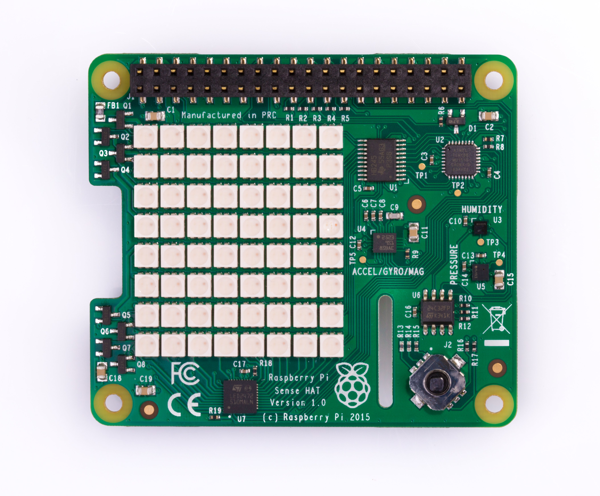

### Build the solution

Go to the `.NET` subdirectory of the cloned source where the `MqttClient4IoT.sln` file is located and run the command: 

>dotnet publish MqttClient4IoT/MqttClient4IoT/.Net/src/Clients/Clients.Rpi/Clients.Rpi.csproj -o rpi-client/

Note that the full path to the `Clients.Rpi.csproj` file may be different on your machine.

Executable files are placed in the `~/rpi-client/` directory.

### Configure the appsettings.json

Use your favourite editor to edit the appsettings.json file.

> cd ~/rpi-client/

> nano appsettings.json 

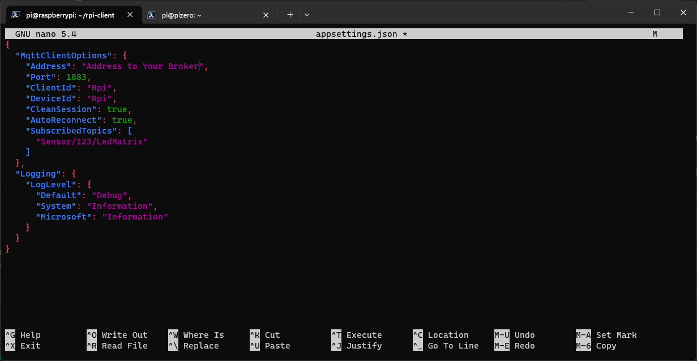

As this is only a tutorial, I have simplified the configuration of the connection to the broker, which currently does not support authentication and encryption.

If you want to use this example in production, I strongly advise you to make this change in the source code and provide these values in the appsettings file.

### Run the Rpi Client

>dotnet Clients.Rpi.dll

If everything is set up correctly, you should see something similar to this:
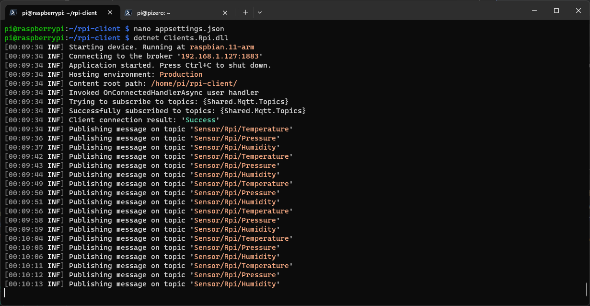

## Clients.RpiZero

Clients.RpiZero is a project targeted to run on the Raspberry Pi Zero 2W board and BMP280 sensor.

**Please make sure you have a `Raspberry Pi Zero 2 W` board as the `Raspberry Pi Zero W` is not compatible with dotnet!** 

List of parts:
* Raspberry Pi Zero 2W
* BMP280 sensor board (any vendor on the market should be compatible)
* two 1kΩ resistors
* one red LED
* one green LED
* breadboard
* some cabling

### Assembling the hardware

To assemble the unit, please follow the breadboard view and schematic.

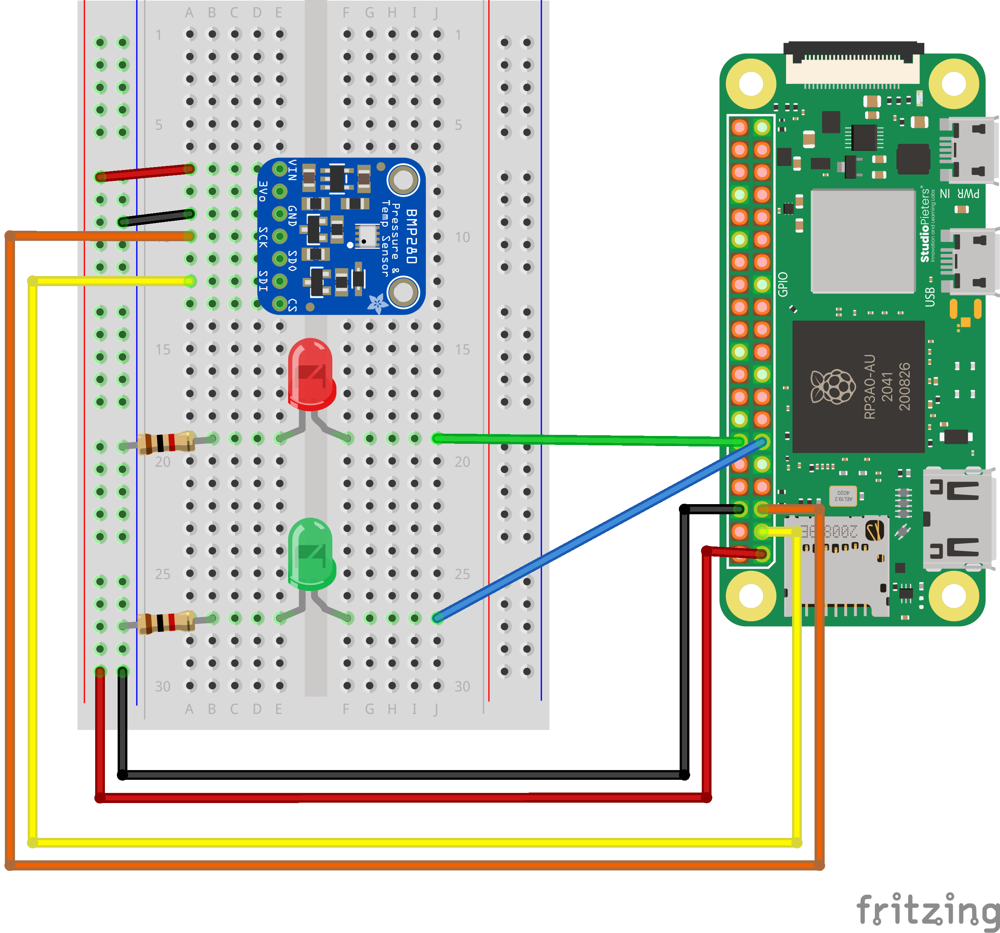

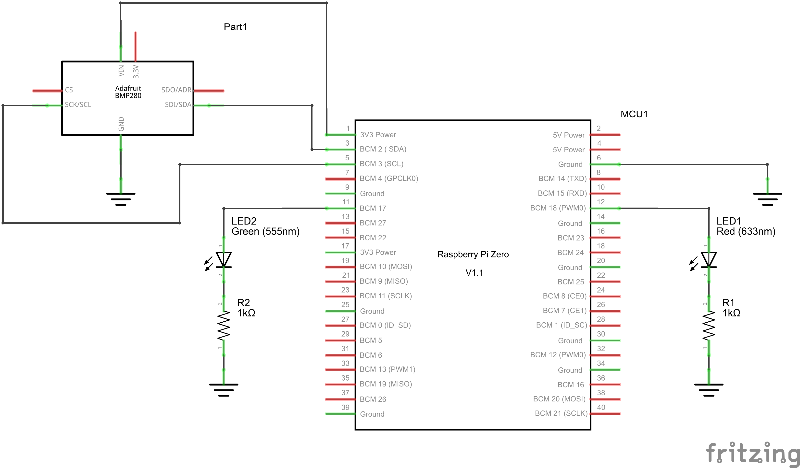

### Build the solution

Go to the `.NET` subdirectory of the cloned source where the `MqttClient4IoT.sln` file is located and run the command:

>dotnet publish MqttClient4IoT/MqttClient4IoT/.Net/src/Clients/Clients.RpiZero/Clients.RpiZero.csproj -o rpiZero-client/

Note that the full path to the `Clients.Rpi.csproj` file may be different on your machine.

Executable files are placed in the `~/rpiZero-client/` directory.

### Configure the appsettings.json

First, we'll need to make sure the BMP280 sensor is properly connected and find its I2C address.

To do this, we need to install i2c tools. 

>sudo apt-get install i2c-tools

Then we need to run the tool.

>sudo i2cdetect -y 1
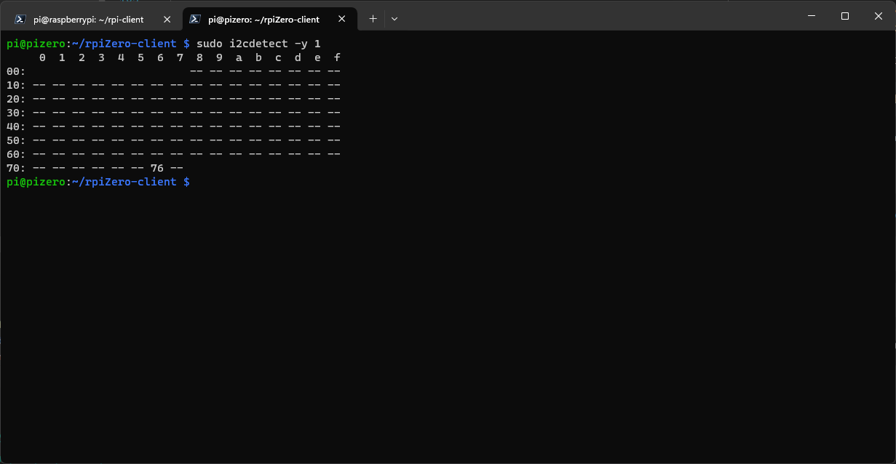

The address of our sensor is 0x76 hexadecimal.

Use your favourite editor to edit the appsettings.json file.

> cd ~/rpi-client/

> nano appsettings.json

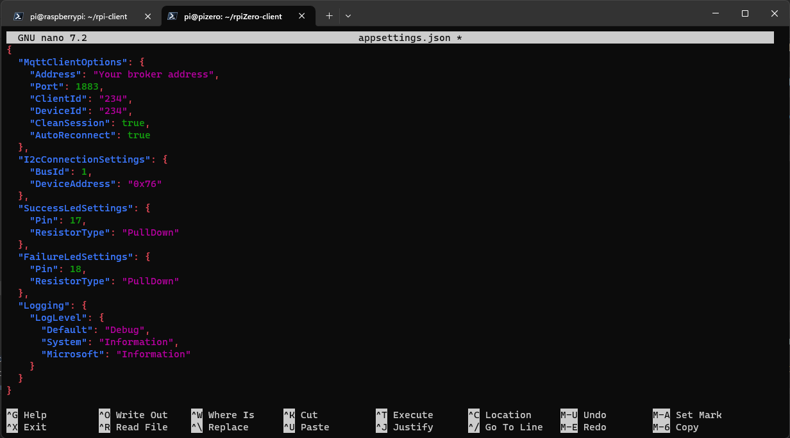

As you can see, 0x76 has been set in the `DeviceAddress` settings.

It is also worth mentioning that the solution is prepared for the situation when the resistors that limit the LED current can be connected to the supply voltage - contrary to what is shown on the breadboard, where it is connected to the ground. In this case the resistor type configuration should be set to `PullUp`. This ensures that the electroluminescent diode lights up when we want it to.

As above, MQTT authentication is simplified.

### Run the Rpi Zero Client

>dotnet Clients.RpiZero.dll

If everything is set up correctly, you should see something similar to this:
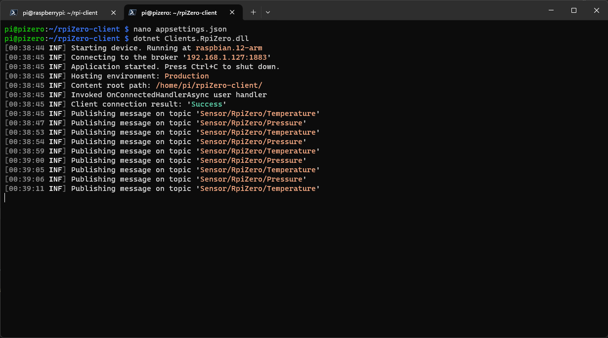