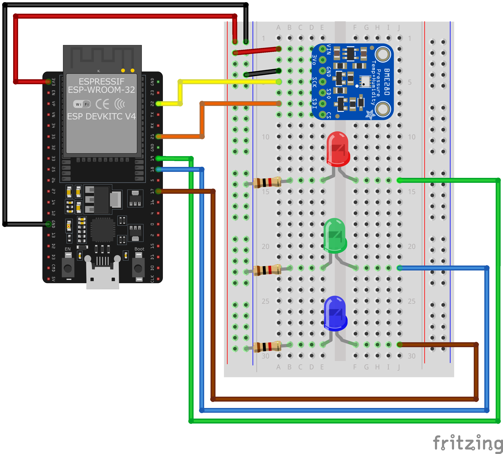
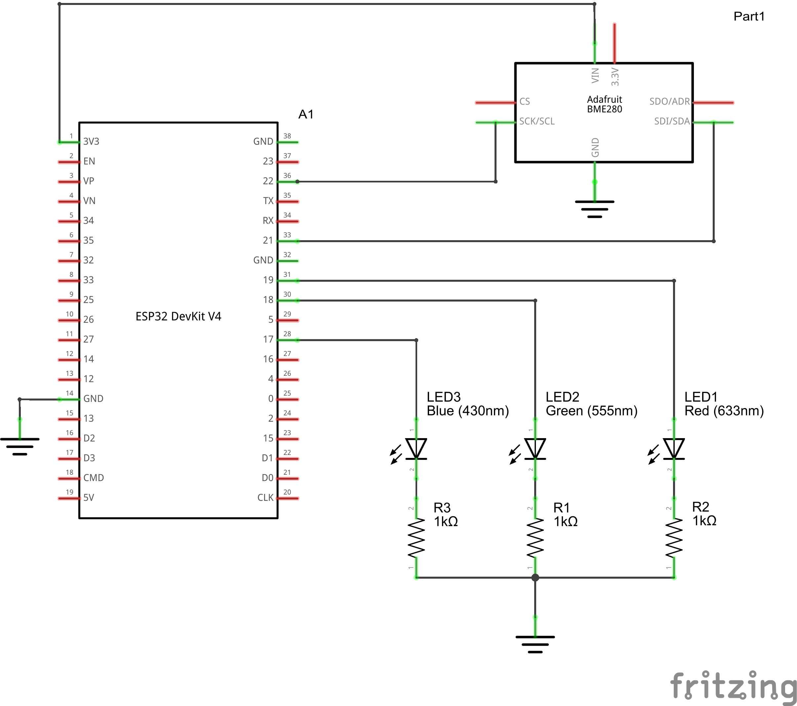
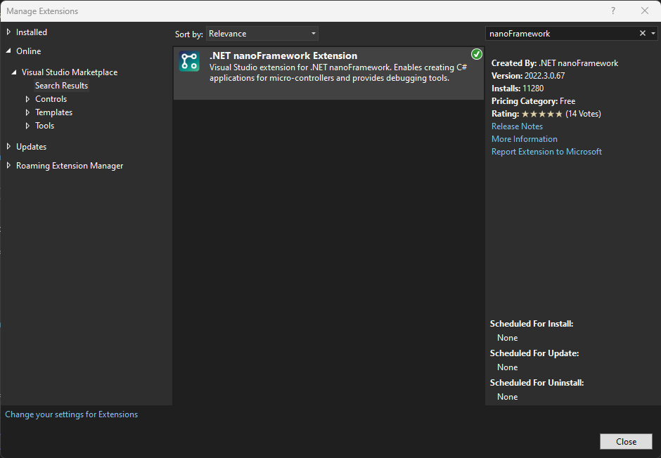
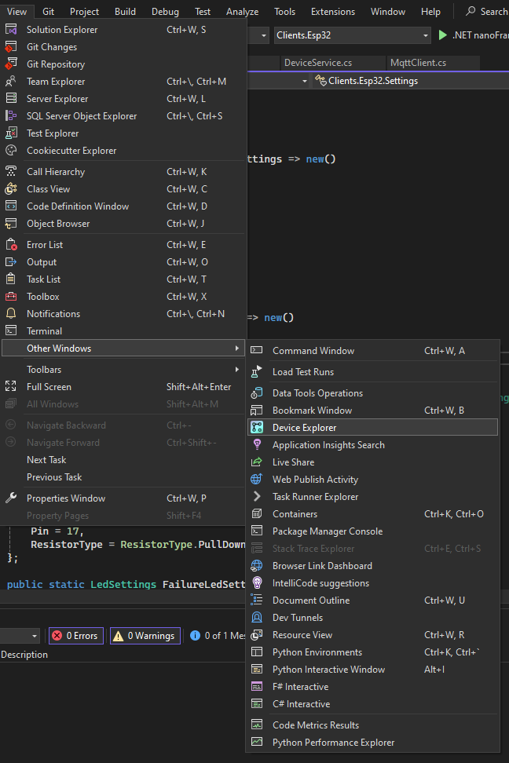
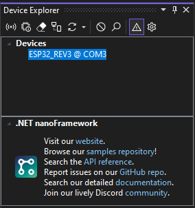
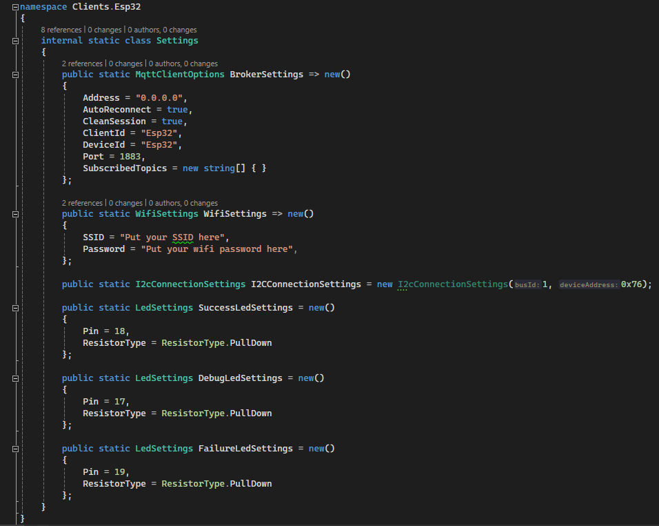
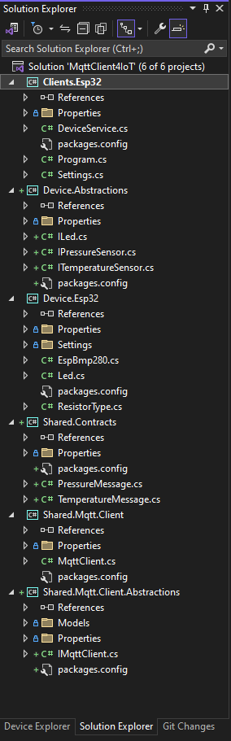
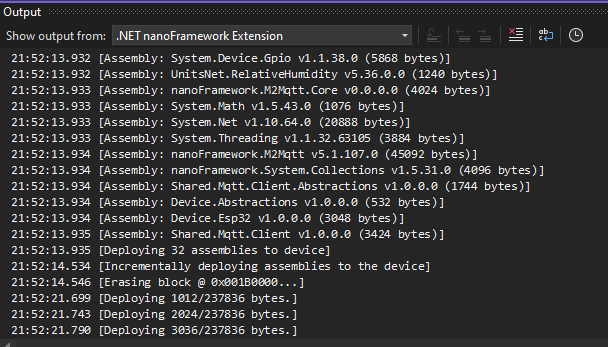

# .NET nanoFramework examples

Typically, IoT devices are based on less powerful and much cheaper hardware than Raspberry Pi. 

.NET nanoFramework makes it possible for C# developers to write embedded applications on microcontrollers units (MCU).

## Client.ESP32

As a platform for learning nanoFramework, I chose ESP32, which is cheap and easy to get.

The nanoFramework website also provides a wealth of ready-to-use examples targeting the ESP32 platform to help you get started with embedded applications written in C#.

List of parts:
* ESP32-DevKitC-32E V4 with builtin ESP-WROOM-32E module or any from the [list](https://docs.nanoframework.net/content/reference-targets/esp32.html)
* BMP280 sensor board (any vendor on the market should be compatible)
* three 1kΩ resistors
* one red LED
* one green LED
* one blue LED
* breadboard
* some cabling
* optional ESP32 terminal adapter (makes prototyping much easier)

### Assembling the hardware

To assemble the unit, please follow the breadboard view and schematic.





### Prepare your tools

1. Install nanoFramework Extension to Visual Studio (a VS Code extension is also available)


2. Install [nanoff](https://github.com/nanoframework/nanoFirmwareFlasher)

> dotnet tool install -g nanoff

3. Connect device to your development machine over micro-USB cable

**IMPORTANT: you may have to install drivers. Refer to the vendor website or use Windows Update to install the latest version of the drivers.**

You need to know the COM Port attached to your device. Search for Computer Management, select Device Manager then expand Ports (COM & LPT), you will find the COM port of the connected device.

4. Reflash your ESP32 with nanoFramework

>nanoff --update --platform esp32 --serialport COM3

5. Clone the git repository with the source code

> git clone https://github.com/zielinski-piotr/MqttClient4IoT.git 

6. Open the project in Visual Studio

Open MqttClient4IoT.sln from the nanoFramework subfolder.

7. Enable Device Explorer 


Note: If the Device Explorer icons are missing, run this command from the Visual Studio executable folder:
> .\devenv.exe /updateConfiguration

8. Select your ESP32 device in Device Explorer
   

9. Configure the application with your WIFI network, Broker address etc.

There is a `Settings` class that holds all the configuration properties of the sample application. This includes the Broker address, Wifi SSID and password, BMP280 I2C address and others.


10. Deploy application to your ESP32

Select the `Clients.Esp32` project in the Solution Explorer end from the context menu select `Deploy` command.


If everything is set up correctly, you should be able to see the progress of the deployment in the Output window:



At the very end of the whole deployment process, you should see `Assemblies successfully deployed to the device`.

Don't worry if you see the message `No flash dump file provided, can't generate deployment image` near the end. This has never caused me any problems.

### Troubleshooting

**Version mismatch**

When deploying the application to the ESP32 device in the output window, you may get errors like this:

```
The connected target has the wrong version for the following assembly(ies):

'mscorlib' requires native v100.5.0.18, checksum 0xCCE8376E.
Connected target has v100.5.0.17, checksum 0x004CF1CE.
```
This means that the device has been reflashed using `nanoff` to a newer version than the nanoFramework nuget packages used in the project.

I would expect this to happen some time after the examples I have prepared have been committed to the git repository and nanoFramework has released a newer firmware version for the device. I will probably not update this repository with every new version of nanoFramework.

---

**WIFI password**

I have been scratching my head for a couple of hours trying to figure out why my ESP32 device is unable to connect to my home wifi network, only to realise that the network SSID had a typo when I set it up without the typo.

---

**Generics**

While as a professional .NET developer I rely heavily on generics, the nanoFramework doesn't currently support this functionality.

The symptom of this problem is that when you try to debug your solution, the debug window shows that the steps nanoFramework takes to resolve dependencies are stuck in a loop.
